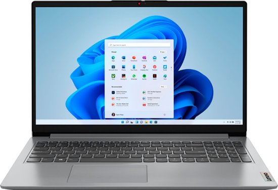
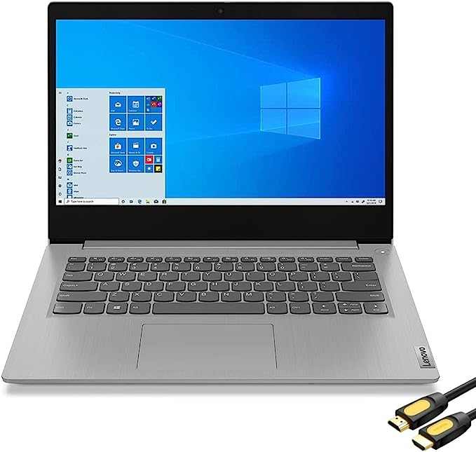

# Recommendation

## CFO's Choice Lenovo IdeaPad

**[IdeaPad](https://www.bestbuy.com/site/lenovo-ideapad-1-15-6-hd-laptop-athlon-silver-7120u-with-4gb-memory-128gb-ssd-cloud-grey/6531746.p?skuId=6531746 "IdeaPad")**

## Recommendation IdeaPad 3i

**[Ideapad3i](https://www.amazon.com/Lenovo-IdeaPad-Business-Student-i3-1115G4/dp/B0BSR6N4WY/ref=sr_1_2_sspa?crid=31ZBEMBLDQUC1&keywords=lenovo%2Blaptop&qid=1689560155&refinements=p_n_feature_thirty-three_browse-bin%3A23720419011&rnid=23720416011&s=pc&sprefix=lenovo%2B%2Caps%2C196&sr=1-2-spons&sp_csd=d2lkZ2V0TmFtZT1zcF9hdGY&th=1 "IdeaPad3i")**

## Recommendation HP Flagship 15.6 HD Pavillion

**[Pavillion](https://www.amazon.com/dp/B0BVZJYJDG?tag=highlightreviews-94074-20&th=1 "32GB HP Pavillion")**

### Looking at the specs for all three laptops I would definitely recommend the *HP Pavillion*. 
1. We have a budget of $700 and the 32 GB HP is priced at $549.00.
2. The CFO's choice really only serves as an entry-level laptop with decent streaming capabilities, but not good.
3. The IdeaPad 3i is a substantial upgrade to the CFO's choice, has more RAM and better storage, and is priced at $319.00.

